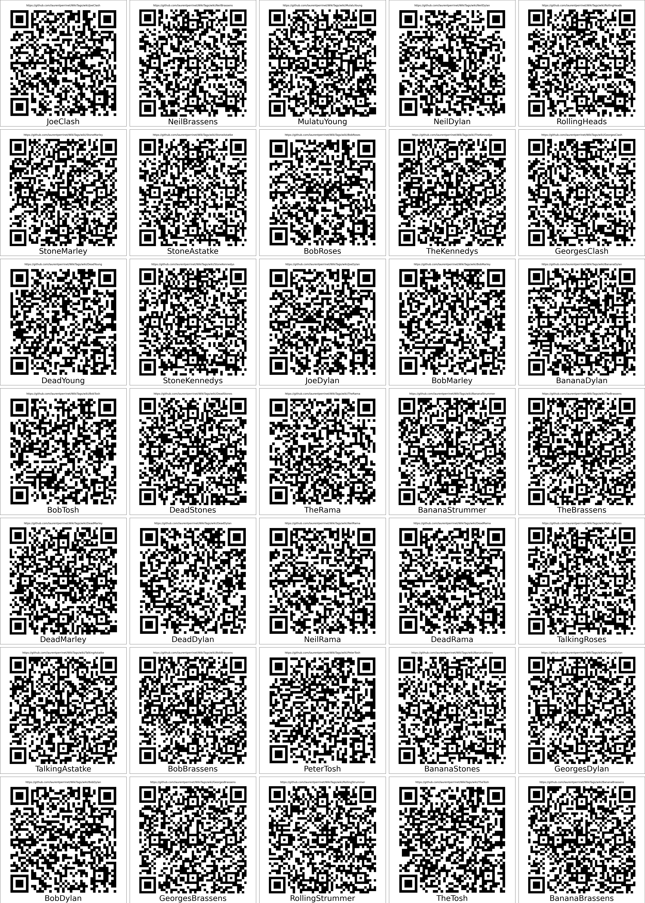

# WikiTags: Editable tagging system for real life

> Beware: for use in real-life!

Whenever you need to create custom-made tags for storage, archival, tupperware©, ... you may want to use a system of labels which you can read or write.

This small script creates a set of QR codes that you can stick on any object. Each point to the URL of a wiki (that is an editable page): Scan it with your phone to see what the tag points to and maybe edit it.

## FAQ

### how do I install it?

Fork the repo, adapt the `WikiTags.py` script to your needs, run it and print the resulting file.

## under the hood

### server side:

- [GitHub' wiki system](https://help.github.com/en/github/building-a-strong-community/about-wikis)
-  alternative = https://wiki.js.org/

### client side:

- use the python script to generate a set of QR codes to your wiki. Be sure to properly set up the root
- print the `grid.png` file (preferentially on sticker) and cut the different QR codes
- stick them all over the place!
