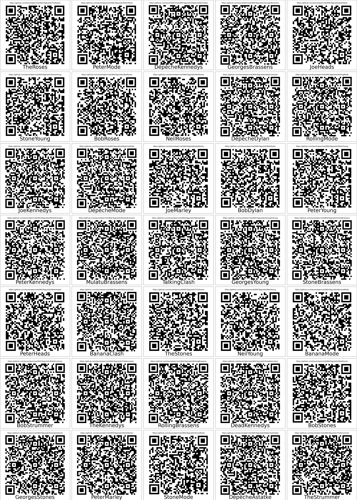

# WikiTags: Lightweight tagging system for real life

For use in real-life, whenever you need to create tags for storage, archival, ... you may use a system of labels which you write to its content. Here, we aim at creating a set of QR codes that you can stick on any object (created on the client side) and a wiki which contain an editable database for the contents.

Scan it with your phone to see what the tag points to.

## under the hood

## server side:

- [GitHub' wiki system](https://help.github.com/en/github/building-a-strong-community/about-wikis)
- https://wiki.js.org/

## client side:

- use the python script to generate a set of QR codes to your wiki. Be sure to properly set up the root
- print the `grid.png` file (preferentially on sticker) and cut the different QR codes
- stick them all over the place!
